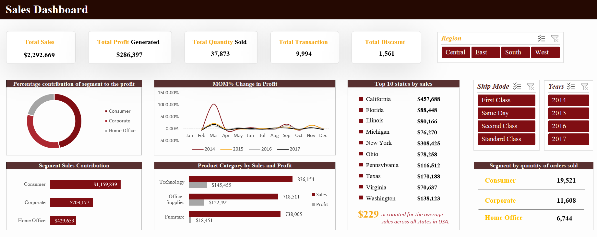

# Sales performance dashboard
A sales performance dashboard built in Excel to visualize revenue trends, top-selling products, and regional performance, with automated data refresh using Power Query.

## Problem statement
Retail teams often spend hours manually merging regional sales files, cleaning errors, and updating reports, delaying insights and risking mistakes. This project builds an automated Excel dashboard that eases data ingestion, cleaning, and visualization so business users can spot trends and act on them quickly.

## How to Use
1. Open `Dashboard.xlsx`.  
2. Go to **Data → Refresh All** to pull in/merge the latest [files](Dataset.xlsx).  
3. Navigate to the **Dashboard** sheet to interact with slicers and view KPIs.  
